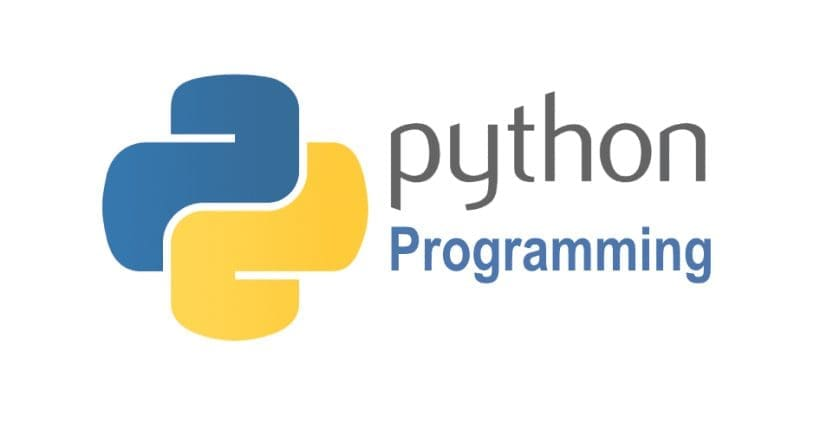

***"Code is the language of logic; practice is the path to proficiency."***  

  
  

  
Welcome to **Python Hands-On** — a curated collection of my hands-on Python programming exercises, crafted to deepen my understanding of this versatile and powerful language. This repository reflects my commitment to not just learning Python in theory, but mastering it through continuous experimentation, practical application, and real coding challenges.

### 🎯 Purpose of this repository  
- To systematically **enhance my proficiency** in core Python concepts through hands-on practice.  
- To maintain an evolving **portfolio of Python implementations** that serve as both a personal reference and a demonstration of my skills.  
- To build a strong foundation that can support advanced topics in data science, machine learning, and software development.

### 📂 Repository Structure
Will be updated soon.

