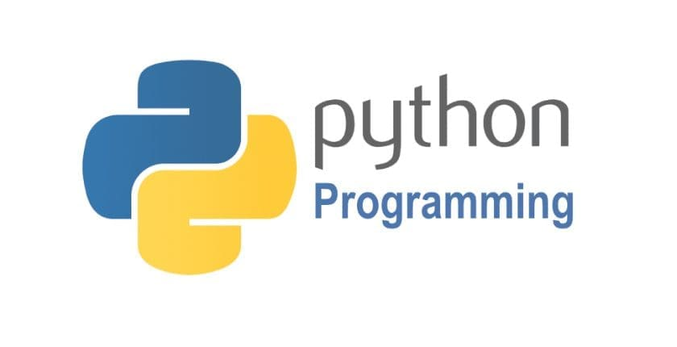

Welcome! You've stumbled upon my **Python Hands-On Collection** — a curated digital notebook of my practical programming exercises. This isn't just a repository of code; it's a showcase of my Python journey through continuous experimentation.

 

## 🎯 &nbsp;The Goal Behind the Collection

I built this collection to:
- Experiment Fearlessly — A sandbox to try, break, and rebuild — because real learning happens in the errors.
- Build an evolving portfolio of Python implementations that serves as my personal reference for future use.
- Lay the groundwork needed to confidently step into Data Science, Machine Learning, and Software Development.

 

## 📖 &nbsp;What's Inside the Collection

Four volumes, each tracing a stage of my Python journey. Feel free to explore the folders!

<table align="center">
  <!-- ROW 1 HEADERS -->
  <tr>
    <table width="100%">
<tr>
<td width="50%" valign="top">

###  &nbsp;Volume I — Core Python

**The Foundation.** Where it all begins — scripts covering the essential building blocks every Python program relies on.

   

###  &nbsp;Volume III — Data Visualization

**The Art of Data.** Numbers are boring until you paint them — experiments in turning raw data into visual insight and clear stories.

-B8860B?style=flat-square&logoColor=white)

</td>
<td width="50%" valign="top">

###  &nbsp;Volume II — Object-Oriented Design

**The Architecture.** Modeling the real world. A deep dive into Python's object-oriented paradigms:

   

###  &nbsp;Volume IV — Data Science Stack

**The Heavy Lifters.** Practical implementations using the most powerful analytical libraries the Python ecosystem has to offer.

</td>
</tr>
</table>

 

## 🤝 &nbsp;Let's Connect

If you're also passionate about Python, Data Science, or just want to chat about tech, I'd love to connect!

)

